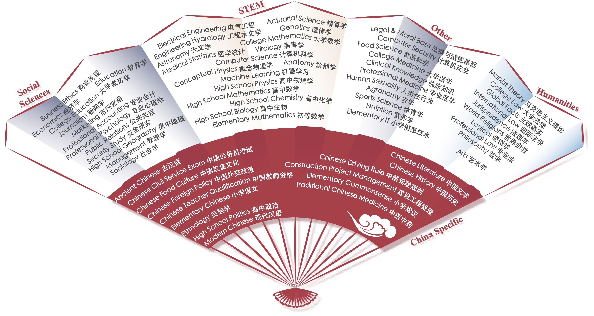

# CMMLU---中文多任务语言理解评估
[](https://github.com/internLM/OpenCompass/) [](https://github.com/EleutherAI/lm-evaluation-harness)

<p align="center">        </p>

<h4 align="center">
    <p>
        <b>简体中文</b> |
        <a href="https://github.com/haonan-li/CMMLU/blob/master/README_EN.md">English</a> 
    <p>
</h4>

<p align="center" style="display: flex; flex-direction: row; justify-content: center; align-items: center">
📄 <a href="https://arxiv.org/abs/2306.09212" target="_blank" style="margin-right: 15px; margin-left: 10px">论文</a> • 
🏆 <a href="https://github.com/haonan-li/CMMLU/#排行榜" target="_blank"  style="margin-left: 10px">排行榜</a> •
🤗 <a href="https://huggingface.co/datasets/haonan-li/cmmlu" target="_blank" style="margin-left: 10px">数据集</a> 
</p>


## 简介

CMMLU是一个综合性的中文评估基准，专门用于评估语言模型在中文语境下的知识和推理能力。CMMLU涵盖了从基础学科到高级专业水平的67个主题。它包括：需要计算和推理的自然科学，需要知识的人文科学和社会科学,以及需要生活常识的中国驾驶规则等。此外，CMMLU中的许多任务具有中国特定的答案，可能在其他地区或语言中并不普遍适用。因此是一个完全中国化的中文测试基准。

注：如果有古汉语的评估需求，欢迎使用[ACLUE](https://github.com/isen-zhang/ACLUE).

<p align="center">        </p>

## 排行榜

> **Note：**
> 自2023-12-16日起，对于未开放公测的API模型，我们将验证 1.模型是否有基本的指令跟随能力；2.是否存在数据污染，通过验证的模型会被更新在榜单。

以下表格显示了模型在 five-shot 和 zero-shot 测试下的表现。

#### Five-shot

| 模型                 | STEM  | 人文学科 | 社会科学 | 其他  | 中国特定主题 | 平均分  |
|---------------------|------|------------|----------------|-------|----------------|---------|
| 开放测试的模型 |
| [PCI-TransGPT](http://123.249.36.167/call-frontend/#/transGpt)    |   76.85   | **86.46** | **81.65** | **84.57** | **82.85** | **82.46** |
| [BlueLM-7B](https://github.com/vivo-ai-lab/BlueLM)                |   61.36   |   79.83   |   77.80   |   78.89   |   76.74   |   74.27   |
| [XuanYuan-70B](https://huggingface.co/Duxiaoman-DI/XuanYuan-70B)  |   60.74   |   77.79   |   75.47   |   70.81   |   70.92   |   71.10   |
| [GPT4](https://openai.com/gpt4)                                   | **65.23** |   72.11   |   72.06   |   74.79   |   66.12   |   70.95   |
| [XuanYuan-13B](https://github.com/Duxiaoman-DI/XuanYuan)          |   50.07   |	66.32	|   64.11   |   59.99	|   60.55	|   60.05   |
| [Qwen-7B](https://github.com/QwenLM/Qwen-7B)                      |   48.39   |   63.77   |   61.22   |   62.14   |   58.73   |   58.66   |
| [ZhiLu-13B](https://github.com/SYSU-MUCFC-FinTech-Research-Center/ZhiLu)   |   44.26   |   61.54   |   60.25   |   61.14   |   57.14   |   57.16   |
| [ChatGPT](https://openai.com/chatgpt)                             |   47.81   |   55.68   |   56.50   |   62.66   |   50.69   |   55.51   |
| [Baichuan-13B](https://github.com/baichuan-inc/Baichuan-13B)      |   42.38   |   61.61   |   60.44   |   59.26   |   56.62   |   55.82   |
| [ChatGLM2-6B](https://huggingface.co/THUDM/chatglm2-6b)           |   42.55   |   50.98   |   50.99   |   50.80   |   48.37   |   48.80   |
| [Baichuan-7B](https://github.com/baichuan-inc/baichuan-7B)        |   35.25   |   48.07   |   47.88   |   46.61   |   44.14   |   44.43   |
| [Falcon-40B](https://huggingface.co/tiiuae/falcon-40b)            |   33.33   |   43.46   |   44.28   |   44.75   |   39.46   |   41.45   |
| [LLaMA-65B](https://github.com/facebookresearch/llama)            |   34.47   |   40.24   |   41.55   |   42.88   |   37.00   |   39.80   |
| [ChatGLM-6B](https://github.com/THUDM/GLM-130B)                   |   32.35   |   39.22   |   39.65   |   38.62   |   37.70   |   37.48   |
| [BatGPT-15B](https://arxiv.org/abs/2307.00360)                    |   34.96   |   35.45   |   36.31   |   42.14   |   37.89   |   37.16   |
| [BLOOMZ-7B](https://github.com/bigscience-workshop/xmtf)          |   30.56   |   39.10   |   38.59   |   40.32   |   37.15   |   37.04   |
| [Chinese-LLaMA-13B](https://github.com/ymcui/Chinese-LLaMA-Alpaca)|   27.12   |   33.18   |   34.87   |   35.10   |   32.97   |   32.63   |
| [Bactrian-LLaMA-13B](https://github.com/mbzuai-nlp/bactrian-x)    |   27.52   |   32.47   |   32.27   |   35.77   |   31.56   |   31.88   |
| [MOSS-SFT-16B](https://github.com/OpenLMLab/MOSS)                 |   27.23   |   30.41   |   28.84   |   32.56   |   28.68   |   29.57   |
| 未开放测试的模型 |
| [BlueLM]()                                                        | **78.16** | **90.50** | **86.88** | **87.87** | **87.55** | **85.59** |
| [Mind GPT]()                                                      |   76.76   |   87.09   |   83.74   |   84.70   |   81.82   |   82.84   |
| [ZW-LM]()                                                         |   72.68   |   85.84   |   83.61   |   85.68   |   82.71   |   81.73   |
| [QuarkLLM](https://www.quark.cn/)                                 |   70.97   |   85.20   |   82.88   |   82.71   |   81.12   |   80.27   |
| [Galaxy](https://www.zuoyebang.com/)                              |   69.61   |   74.95   |   78.54   |   77.93   |   73.99   |   74.03   |
| [KwaiYii-66B](https://github.com/kwai/KwaiYii)                    |   56.70   |   79.43   |   72.84   |   74.43   |   71.11   |   71.12   |
| [Mengzi-7B](https://www.langboat.com/)                            |   49.59   |   75.27   |   71.36   |   70.52   |   69.23   |   66.41   |
| [KwaiYii-13B](https://github.com/kwai/KwaiYii)                    |   46.54   |   69.22   |   64.49   |   65.09   |   63.10   |   61.73   |
| [MiLM-6B](https://github.com/XiaoMi/MiLM-6B/)                     |   46.85   |   61.12   |   61.68   |   58.84   |   59.39   |   57.17   |
| [MiLM-1.3B](https://github.com/XiaoMi/MiLM-6B/)                   |   35.59   |   49.58   |   49.03   |   47.56   |   48.17   |   45.39   |
| Random                                                            |   25.00   |   25.00   |   25.00   |   25.00   |   25.00   |   25.00   |


#### Zero-shot
| 模型                 | STEM  | 人文学科 | 社会科学 | 其他  | 中国特定主题 | 平均分  |
|---------------------|------|------------|----------------|-------|----------------|---------|
| 开放测试的模型 |
| [PCI-TransGPT](http://123.249.36.167/call-frontend/#/transGpt)    |   76.69   | **86.26** | **81.71** | **84.47** | **83.13** | **82.44** |
| [BlueLM-7B](https://github.com/vivo-ai-lab/BlueLM)                |   62.08   |   81.29   |   79.38   |   79.56   |   77.69   |   75.40   |
| [XuanYuan-70B](https://huggingface.co/Duxiaoman-DI/XuanYuan-70B)  |   61.21   |   76.25   |   74.44   |   70.67   |   69.35   |   70.59   |
| [GPT4](https://openai.com/gpt4)                                   | **63.16** |   69.19   |   70.26   |   73.16   |   63.47   |   68.90   |
| [XuanYuan-13B](https://github.com/Duxiaoman-DI/XuanYuan)          |   50.22   |	67.55	|   63.85	|   61.17   |   61.50	|   60.51   |
| [Qwen-7B](https://github.com/QwenLM/Qwen-7B)                      |   46.33   |   62.54   |   60.48   |   61.72   |   58.77   |   57.57   |
| [ZhiLu-13B](https://github.com/SYSU-MUCFC-FinTech-Research-Center/ZhiLu)  |   43.53   |   61.60   |   61.40   |   60.15   |   58.97   |   57.14   |
| [ChatGPT](https://openai.com/chatgpt)                             |   44.80   |   53.61   |   54.22   |   59.95   |   49.74   |   53.22   |
| [Baichuan-13B](https://github.com/baichuan-inc/Baichuan-13B)      |   42.04   |   60.49   |   59.55   |   56.60   |   55.72   |   54.63   |
| [ChatGLM2-6B](https://huggingface.co/THUDM/chatglm2-6b)           |   41.28   |   52.85   |   53.37   |   52.24   |   50.58   |   49.95   |
| [BLOOMZ-7B](https://github.com/bigscience-workshop/xmtf)          |   33.03   |   45.74   |   45.74   |   46.25   |   41.58   |   42.80   |
| [Baichuan-7B](https://github.com/baichuan-inc/baichuan-7B)        |   32.79   |   44.43   |   46.78   |   44.79   |   43.11   |   42.33   |
| [ChatGLM-6B](https://github.com/THUDM/GLM-130B)                   |   32.22   |   42.91   |   44.81   |   42.60   |   41.93   |   40.79   |
| [BatGPT-15B](https://arxiv.org/abs/2307.00360)                    |   33.72   |   36.53   |   38.07   |   46.94   |   38.32   |   38.51   |
| [Falcon-40B](https://huggingface.co/tiiuae/falcon-40b)            |   31.11   |   41.30   |   40.87   |   40.61   |   36.05   |   38.50   |
| [LLaMA-65B](https://github.com/facebookresearch/llama)            |   31.09   |   34.45   |   36.05   |   37.94   |   32.89   |   34.88   |
| [Bactrian-LLaMA-13B](https://github.com/mbzuai-nlp/bactrian-x)    |   26.46   |   29.36   |   31.81   |   31.55   |   29.17   |   30.06   |
| [Chinese-LLaMA-13B](https://github.com/ymcui/Chinese-LLaMA-Alpaca)|   26.76   |   26.57   |   27.42   |   28.33   |   26.73   |   27.34   |
| [MOSS-SFT-16B](https://github.com/OpenLMLab/MOSS)                 |   25.68   |   26.35   |   27.21   |   27.92   |   26.70   |   26.88   |
| 未开放测试的模型 |
| [BlueLM]()                                                        | **76.36** | **90.34** | **86.23** | **86.94** | **86.84** | **84.68** |
| [云天天书]()                                                       |   73.03   |   83.78   |   82.30   |   84.04   |   81.37   |   80.62   |
| [Mind GPT]()                                                      |   71.20   |   83.95   |   80.59   |   82.11   |   78.90   |   79.20   |
| [QuarkLLM](https://www.quark.cn/)                                 |   67.23   |   81.69   |   79.47   |   80.74   |   77.00   |   77.08   |
| [Galaxy](https://www.zuoyebang.com/)                              |   69.38   |   75.33   |   78.27   |   78.19   |   73.25   |   73.85   |
| [ZW-LM]()                                                         |   63.93   |   77.95   |   76.28   |   72.99   |   72.94   |   72.74   |
| [KwaiYii-66B](https://github.com/kwai/KwaiYii)                    |   55.20   |   77.10   |   71.74   |   73.30   |   71.27   |   69.96   |
| [Mengzi-7B](https://www.langboat.com/)                            |   49.49   |   75.84   |   72.32   |   70.87   |   70.00   |   66.88   |
| [KwaiYii-13B](https://github.com/kwai/KwaiYii)                    |   46.82   |   69.35   |   63.42   |   64.02   |   63.26   |   61.22   |
| [MiLM-6B](https://github.com/XiaoMi/MiLM-6B/)                     |   48.88   |   63.49   |   66.20   |   62.14   |   62.07   |   60.37   |
| [MiLM-1.3B](https://github.com/XiaoMi/MiLM-6B/)                   |   40.51   |   54.82   |   54.15   |   53.99   |   52.26   |   50.79   |
| Random                                                            |   25.00   |   25.00   |   25.00   |   25.00   |   25.00   |   25.00   |


## 如何提交测试结果

* 对于开源或开放API的模型，可直接提交拉取请求（可以选择同时在`src`目录下更新测试代码）。
* 如模型未开放公测，请发送测试代码到haonan.li@librai.tech，同时将测试结果更新在榜单，并提交拉取请求。我们会在验证结果的真实性之后更新榜单。

## 数据
我们根据每个主题在[data](data)目录中提供了开发和测试数据集。您也可以通过[Hugging Face](https://huggingface.co/datasets/haonan-li/cmmlu)或取我们的数据。

#### 快速使用

我们的数据集已经添加到 [lm-evaluation-harness](https://github.com/EleutherAI/lm-evaluation-harness) 和 [OpenCompass](https://github.com/InternLM/opencompass) 中，您可以通过这些开源平台快速测试。

#### 数据格式
数据集中的每个问题都是一个多项选择题，有4个选项，只有一个选项是正确答案。数据以逗号分隔的.csv文件形式存在。示例：

```
    同一物种的两类细胞各产生一种分泌蛋白，组成这两种蛋白质的各种氨基酸含量相同，但排列顺序不同。其原因是参与这两种蛋白质合成的,tRNA种类不同,同一密码子所决定的氨基酸不同,mRNA碱基序列不同,核糖体成分不同,C
```

#### 提示
我们在`src/mp_utils`目录中提供了预处理代码。其中包括我们用于生成直接回答提示和思路链 (COT) 提示的方法。

以下是添加直接回答提示后的数据示例：

```
    以下是关于(高中生物)的单项选择题，请直接给出正确答案的选项。
    题目：同一物种的两类细胞各产生一种分泌蛋白，组成这两种蛋白质的各种氨基酸含量相同，但排列顺序不同。其原因是参与这两种蛋白质合成的：
    A. tRNA种类不同
    B. 同一密码子所决定的氨基酸不同
    C. mRNA碱基序列不同
    D. 核糖体成分不同
    答案是：C

    ... [其他例子] 

    题目：某种植物病毒V是通过稻飞虱吸食水稻汁液在水稻间传播的。稻田中青蛙数量的增加可减少该病毒在水稻间的传播。下列叙述正确的是：
   
    A. 青蛙与稻飞虱是捕食关系
    B. 水稻和病毒V是互利共生关系
    C. 病毒V与青蛙是寄生关系
    D. 水稻与青蛙是竞争关系
    答案是： 
```

对于思路链提示，我们将提示从“请直接给出正确答案的选项”修改为“逐步分析并选出正确答案”。

#### 评估
我们使用的每个模型的评估代码位于[src](src)中，运行它们的代码列在[script](script)目录中。


## 引用

```
@misc{li2023cmmlu,
      title={CMMLU: Measuring massive multitask language understanding in Chinese}, 
      author={Haonan Li and Yixuan Zhang and Fajri Koto and Yifei Yang and Hai Zhao and Yeyun Gong and Nan Duan and Timothy Baldwin},
      year={2023},
      eprint={2306.09212},
      archivePrefix={arXiv},
      primaryClass={cs.CL}
}
```
## 许可证

CMMLU数据集采用
[Creative Commons Attribution-NonCommercial-ShareAlike 4.0 International License](http://creativecommons.org/licenses/by-nc-sa/4.0/).
